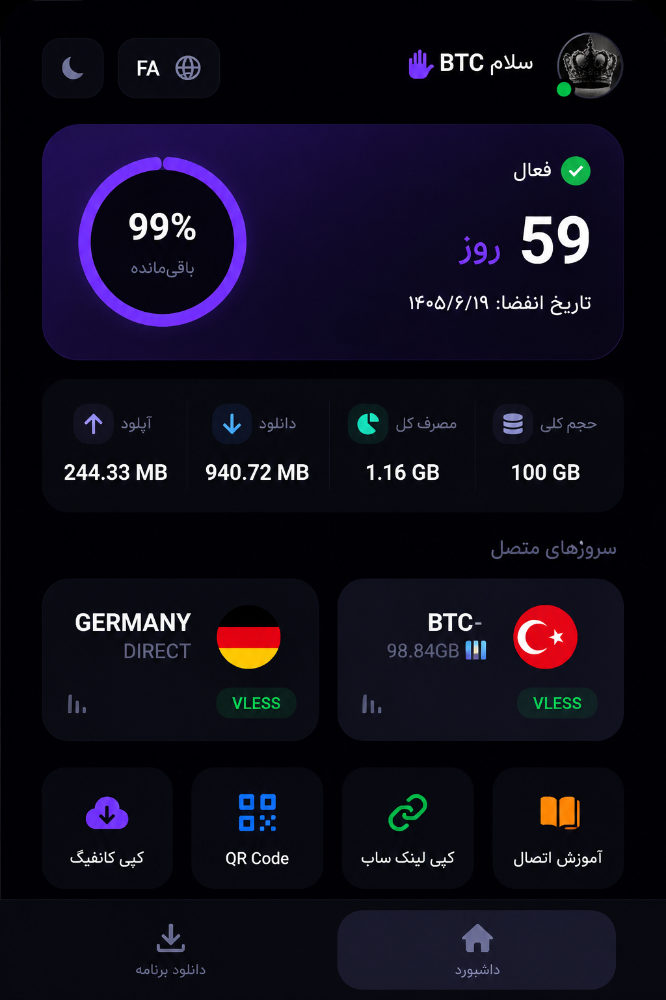

# 📊 قالب 3x-ui شیک و مدرن (رایگان)

یک فرانت‌اند مدرن، زیبا و بهینه برای نمایش وضعیت مصرف، زمان باقی‌مانده و حجم کانفیگ‌های کاربران در پنل 3X-UI.

<p align="center">
  
</p>

---

## ✨ ویژگی‌ها

- 📱 طراحی کاملاً واکنش‌گرا (Responsive)
- 🌙 رابط کاربری مدرن با تم تیره
- 🌍 پشتیبانی از ۴ زبان (فارسی، انگلیسی، عربی و ترکی)
- ⏱️ نمایش روزهای باقی‌مانده از اعتبار سرویس
- 📊 نمایش مصرف حجم، آپلود و دانلود
- 🌐 پشتیبانی از چند سرور و نمایش وضعیت آن‌ها
- 📥 دانلود مستقیم برنامه‌های موردنیاز
- 📋 کپی سریع لینک ساب و کانفیگ
- 📷 نمایش QR Code
- ⚡ عملکرد روان و بهینه

---

## 🚀 نصب خودکار

دستور زیر را در ترمینال سرور اجرا کنید:

```bash
curl -fsSL https://raw.githubusercontent.com/hamedstajloo/sanaei-user-panel/main/index.html -o /etc/x-ui/index.html && systemctl restart x-ui
```

---

## ⚙️ فعال‌سازی در 3X-UI

1. وارد پنل **3X-UI** شوید.
2. به بخش **Subscription Settings** بروید.
3. در قسمت **Custom Path** مسیر زیر را وارد کنید:

```text
/etc/x-ui/
```

4. تنظیمات را ذخیره کنید.

---

## 📁 ساختار پروژه

```text
sanaei-user-panel/
├── index.html
├── preview.jpg
├── README.md
└── LICENSE
```

---

## 🤝 مشارکت

در صورت تمایل می‌توانید پیشنهادات و Pull Requestهای خود را ارسال کنید.

---

## 📄 License

This project is licensed under the MIT License.

---


<p align="center">

**ساخته شده با ♥️ توسط بمبئی | VPN**

</p>
